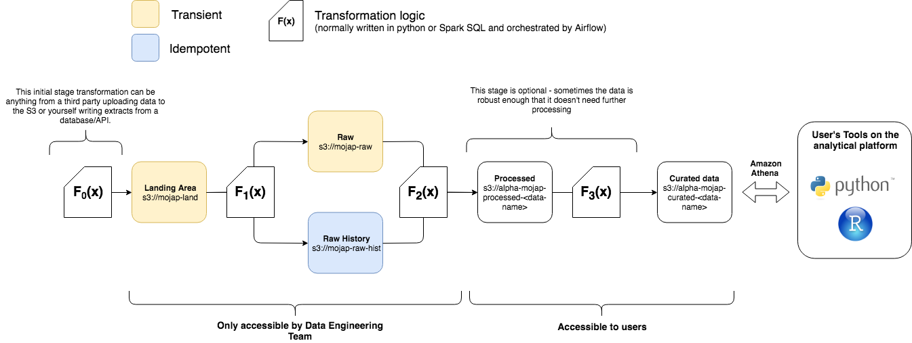

# Background



The image above lays out the processing structure we aim to adhere to as Data Engineers at the Ministry of Justice and serves as the backbone of `opg-pipeline-builder` extract, transform and load (ETL) pipelines. We are going to go through an overview of why we try to adhere to this structure.

The first thing to note is our tech stack. We use AWS S3 for data storage, our transformation logic to move data from A to B is not restricted to but normally carried out in Python or Spark (SQL). These scripts are versioned on GitHub and ran as Dockerised containers on our Kubernetes Cluster. The orchestration of these tasks to run our full pipeline is managed by Apache Airflow.

## Landing Area

All the data that we process is always written into this landing area first. We either receive data from others or extract it ourselves and write it to the landing area. Some key notes to this s3 location:

- Who (or what) writes data to that location should have write access to that s3 path only.
- Data in this folder is transient meaning that once it's processed it is deleted from its folder.

## Raw History

When data lands into our landing area, `s3://mojap-land` in this case, we want some code (`F1(x)`) to check the data and make sure that it's as expected - this may be something like has the correct extension, does have the expected type of data, expected volumes etc. If the data passes the checks then the data that falls into land should be moved from `s3://mojap-land` to `s3://mojap-raw-hist` (and optionally, also `s3://mojap-raw`, see below). This function should not transform the data it should only check it's validity. We want to ensure that the data in `moj-raw-hist` is an exact replica of what the data was when it landed in `mojap-land`. **This is vital for reproducibility.** Any time data falls into `moj-raw-hist` it is treated as an immutable block. Changes to the data / corrections will happen later down the pipeline. The original raw data is never be changed. When data is moved from from `land` to `raw-hist` it is partitioned so that it is easy to trace back the date/time it was moved over.

We use `file_land_timestamp` as a file partition of when the data was uploaded to the land bucket in S3. We use hive partitioning [for more details](https://resources.zaloni.com/blog/partitioning-in-hive) as it allows you to point AWS Athena or Apache Spark directly at the data folder `my-table` and treat that as a dataframe with that's partitioned by a column named `file_land_timestamp`. When your function tests and moves data from data from land to raw you should keep the same folder structure only changing the bucket name (making it easy to cut and paste the data from one bucket to another after it passes the testing function). Below is an example of what you `raw-hist` bucket should look like:

```
└── s3://mojap-raw-hist
│   └── production-environment
│       └── my-database-data
│           └── my-table-data
│               └── file_land_timestamp=1534968800
│                   └── data_1534968800.csv
│               └── file_land_timestamp=1534978800
│                   └── data_1534978800.csv
```

This structure shows that there have been two dataset loaded from `land` into `raw-hist` at different times. Following the same naming conventions means that it is easy to track your data between each process. We follow good practice and suffix our data file itself with the timestamp value in case someone accidentally moves the data.

## Raw

This area is optional. If data is large processed data/deltas may be added to our existing database rather creating everything from scratch from `raw-hist`. It is recommended that if the relative computational overheard in recalculating everything from scratch is minor (compared to running a more complex code to update your existing data with a delta) then you everything is recalculated from scratch as this makes scripts to transform data simpler, idempotent and less dependent on the state of the current database.

However if the database needs to be updated by deltas or have a preprocess stage (see below) then a `raw` folder / step can be used. This will be transient like `land` i.e. once done with the data delete it is deleted (as there should be an exact copy in `raw-hist`). Continuing with our example the folder structure should mimic that of `raw-hist`/`land` just with a different bucket name e.g.

```
└── s3://mojap-raw
│   └── production-environment
│       └── my-database-data
│           └── my-table-data
│               └── file_land_timestamp=1534978800
│                   └── data_1534978800.csv
```

## Processed

This area is again optional. If data in raw is complex then this stage may be required. For example, corrupted CSVs received from external data suppliers may need a custom csv parser to fix the dataset. This is a costly process and so will be applied once to the data as it comes in. In most cases data taken from the `raw` folder will be transformed into into a more usable dataset and written to a `processed` bucket - this is the role of the `F2(x)` function in the diagram. Normal convention is to delete the data from `raw` once it has been written to the `processed` bucket (this is where the idea of these folders being transient comes in once it's been moved to `A -> B` get rid of it from `A`). Again it is good practice to keep the same file partitioning and naming convention as the `raw` or `raw-hist` folder (making it easy to track data across our processes). Therefore the processed folder would be something like:

```
└── s3://alpha-mojap-processed-my-data
│   └── production-environment
│       └── my-database-data
│           └── my-table-data
│               └── file_land_timestamp=1534978800
│                   └── data_1534978800.jsonl.gz
```

or

```
└── s3://alpha-mojap-processed-my-data
│   └── production-environment
│       └── my-database-data
│           └── my-table-data
│               └── file_land_timestamp=1534968800
│                   └── data_1534968800.jsonl.gz
│               └── file_land_timestamp=1534978800
│                   └── data_1534978800.jsonl.gz
```

Some extra things to note about the processed bucket:

- The reason why there are two examples above are dependant on the ETL pipeline. If the pipeline only updated a deployed database with deltas then you would have the first option where you only store the deltas to update the database in the processed bucket. Once the deployed database is updated the data in processed would be deleted (in this instance the processed bucket is transient like raw). If the database is recreated from scratch each time all processed datasets will be kept to save having to process all data from `raw-hist` every time to update the database (in this case the `processed` bucket is treated more like `raw-hist` - although it's worth noting that there might be a point where everything in `processed` needs to be reprocessed e.g. if the processing code is updated. This means it's not immutable like `raw-hist` where data is never deleted).

- Note that the data type has changed from `.csv` to `.json.gz` this is just to denote that the data is actually different to the data in `raw` or `raw-hist`. For recommended datasets see the Data storage best practice section.

- All our processes (i.e. `F(x)`) run in a versioned docker build on our kubernetes cluster. The version tag of our docker build relates to the git tag. It's good practice to add a column to the data that is equal to the tag that processed the data. This helps retrieve the data processed by a given version of your code. The normal convention is to put the tag of the docker image as an environment variable in your airflow DAG (and pass it as an environment variable to the container) so any code can pull this tag from the environment.

### Curated

As discussed above this data is created from either the `raw`, `raw-hist` or `processed` bucket depending on the ETL process. The data will usually be converted to parquet files to speed up subsequent queries based on this data. The curated bucket will hold the data that is exposed as an Athena database. This data does not have to follow the partitioning of the previous buckets (as a different structure may be more efficient to query). An example of a curated folder structure on S3 would be:

```

└── s3://alpha-mojap-curated-my-data
│   └── production-environment
│   └── my-database/
│          └── table1/
│               └── data-part-0.parquet
│               └── data-part-1.parquet
│               └── data-part-2.parquet
│               └── data-part-3.parquet
│           └── table2/
│               └── partition=0/
│                   └── data-part-0.parquet
│                   └── data-part-1.parquet
│               └── partition=1/
│                   └── data-part-0.parquet
│                   └── data-part-1.parquet
```

As stated before, it doesn't have to follow the previous structures. The data structure of this bucket is more up to the data engineer and how they best think to structure the data. Something worth noting is that the data for each table is in a folder where the folder name matches the table name (matching the names just makes things easier to read). All the tables are in the same directory (this again is just good practice for easier understanding of the data structure).

Once the curated tables are produced a glue schema will be overlaid (this is the meta data database schema that allows Athena to query the data the schema points to) over the data to make it accessible to analysts. Something to note is that because Athena is "schema on read" you can define/delete/update the schema without affecting the data underneath. You can think of the schemas that define our data as databases are just overlaid over the data (they just tell Athena how to parse the data and interpret the datasets in S3 using SQL). This means you can delete and recreate your entire database schema at the end or beginning of your ETL job (normally it is done at the end but sometimes you might want to do it at particular points of your etl pipeline if your pipeline requires to read data via the glue schemas).
